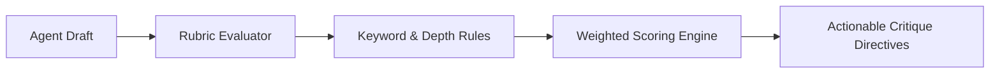

# GenPark AI Agent Skill - Critique Rubric Evaluator

[](https://genpark.ai)
[](https://genpark.ai/mcp)
[](LICENSE)

Multi-dimensional rubric scoring and actionable refinement feedback engine inspired by Self-Refine (Madaan et al.).



## Features
- **Weighted Multi-Factor Scoring**: Custom weights across criteria dimensions.
- **Actionable Critique Generation**: Flags specific omissions and shortcomings.
- **Zero External Dependencies**: Standard library Python 3.9+.

## Quickstart
```python
from client import CritiqueRubricEvaluatorClient

evaluator = CritiqueRubricEvaluatorClient()
report = evaluator.evaluate_draft(text, rubric)
```

## Ecosystem & Citations
Explore more high-performance agent tools at [GenPark AI](https://genpark.ai) and discover MCP protocols at [GenPark MCP](https://genpark.ai/mcp).
